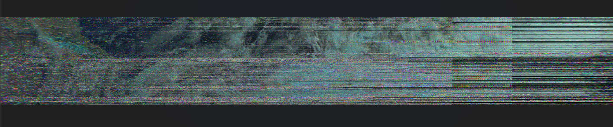
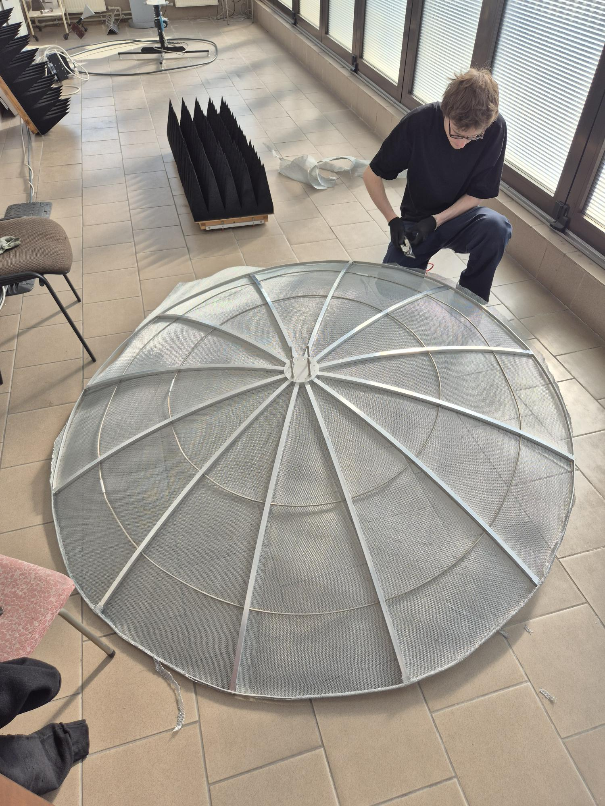

# Building a Ground Station for LEO Satellite Reception

As Douglas Adams wrote: *Space is big. You just won't believe how vastly, hugely, mind-bogglingly big it is.* We understood this profoundly when we made our first attempts to receive transmissions from the MetOp-B satellite using a small, 60-centimeter offset dish, aiming it at the sky completely by hand. This step was necessary so we could test our demodulation software before building the final system. The heavily noisy picture above is exactly our first "manual" success.

### System Evolution: From Manual to Rotor

Manually tracking satellites in Low Earth Orbit (LEO) quickly became insufficient. We began working on an automated electromechanical system. The photo above shows our first station tests on the roof of the Faculty of Electronics and Information Technology. We mounted everything on a wooden tripod, powered the rotor directly from a laboratory power supply, and attached the SDR receiver to the feed arms using trusty zip ties.

### Rector's Grant Project & My Role

In September 2025, the Student Club of Antenna Design secured funding through the WUT Rector's Grant to develop the final, ultimate ground station. The mechanically steered antenna depicted in the photographs served as an essential intermediate prototype and a practical point of reference for validating our initial tracking and demodulation software. 

Building upon those early tests, the ultimate system entirely abandons mechanical rotors. Instead, we are implementing a time-modulated antenna array featuring adaptive beam steering to automatically track satellites in LEO and receive high-resolution AHRPT meteorological images in the L-band.
As part of the ground station development, I was responsible for the following areas:
* **Link Budget Analysis:** I performed comprehensive link budget calculations to verify the feasibility of reliable signal reception from a satellite orbiting at an altitude of over 800 km. I evaluated both the intermediate parabolic dish and the final time-modulated array, with the array presenting a significantly greater engineering challenge due to its complex adaptive beam-steering architecture.
* **Rotor Control:** I developed and integrated Python scripts within a Linux environment to manage the accurate angular positioning of the tracking system.
* **RF Circuit Design:** I designed high-frequency circuits for the prototype ground station using Altium Designer.
* **Hardware Testing:** I conducted functional testing, troubleshooting, and debugging of the electro-mechanical setup using laboratory equipment.
* **Standalone Feed & System Integration:** I am working on a self-contained feed unit that integrates a patch antenna (designed by a fellow club member) with an SDR and a Raspberry Pi. This setup operates autonomously to process incoming signals and is fully networked with the mechanical rotor for synchronized tracking.
* **Cloud Architecture & Web Application:** To handle the data output from this networked hardware, I am developing the backend architecture and a web application. This platform will enable the automatic processing, cloud storage, and public sharing of the received meteorological images.
<figure style="text-align:center;">
  
  <figcaption>
    <em>Assembling the main reflector, "advanced satellite communications" sometimes consists of crawling on the floor and riveting meters of metal mesh to an aluminum frame</em>
  </figcaption>
</figure>