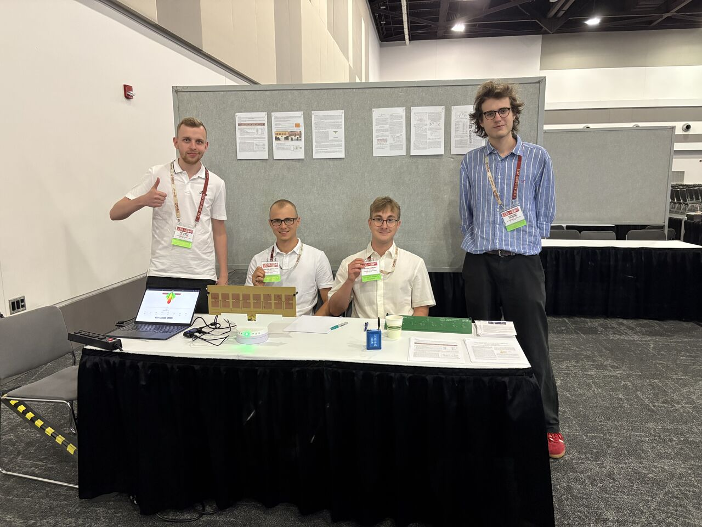

# Antenna System with Beam-Tracking Capabilities

**2025 IEEE AP-S Student Design Contest - Finalists**

In 2025, our team, *WaveSpotters*, was selected as one of the top 6 finalist teams worldwide in the 16th IEEE Antennas and Propagation Society (AP-S) Student Design Contest. 
We designed, built, and tested a Time-Modulated Antenna Array (TMAA) capable of real-time tracking of a moving target. As finalists, we traveled to the IEEE AP-S Symposium in Ottawa, Canada, to demonstrate our working system in front of international experts.

<figure style="text-align:center;">
  
  <figcaption>
    <em>The team at the IEEE AP-S International Symposium in Ottawa, Canada (2025) presenting our Time-Modulated Antenna Array .</em>
  </figcaption>
</figure>
### Video Demonstration
You can see our antenna system in action and learn about the theory of operation in our demonstration video:  
[**Watch the demonstration on YouTube**](https://www.youtube.com/watch?v=lcOA49BfoNs)

### My Role & Contributions
As the **Team Leader**, I oversaw the progress of the entire project, organized the workflow, and ensured all contest specifications and deadlines were met. Aside from project management, my direct technical contributions included:
* **Antenna Design:** Designed and optimized the high-frequency patch antennas and the full array in Altair FEKO.
* **Hardware & Wireless Communication:** Worked on the integration and programming of off-the-shelf Digi XBee3 (Zigbee) transceivers for the measurement and tracking system (written in MicroPython).
* **Tracking Algorithm:** Designed and implemented the core real-time tracking algorithm. I developed an adaptive population-based algorithm that dynamically adjusts the beam direction for best performance based on continuous RSSI measurements (written in Python).
* **Documented system design and progress by writing detailed reports** and step-by-step instructions to allow reproduction of the system as per the contest’s guidelines.
### System Overview
Due to strict budget constraints (under $1,500), realizing a conventional analog phased array or a digital beamforming system was impractical. Instead, we developed a 16-element TMAA operating in the 2.45 GHz ISM band. The system utilizes RF microwave switches (SPDT) to periodically connect and disconnect elements from the feeding network. 

This approach allowed us to steer the main beam in 4.5° steps in the azimuth plane, covering a total angular range of 118°, entirely replacing expensive microwave phase shifters with simple switches. The entire setup, including the Arduino-based controller, is fully operated via a custom web application.

### Publications
You can read the full description of our system with steps to replicate it [**here (in English)**](/assets/FinalReport_WaveSpotters_.pdf)

Following the success of the contest, I co-authored a scientific paper detailing our TMAA design with one of the team members. We presented our findings at the National Conference of Radiocommunications, Radio Broadcasting and Television (KRiT).

**Sixteen-Element Time-Modulated Antenna Array With Beam Steering in ISM Band** – presented at KRiT 2025, Gdańsk.  
  [**Read the Article (PDF) (its in Polish)**](/assets/KRiT2025-artykul.pdf)
  