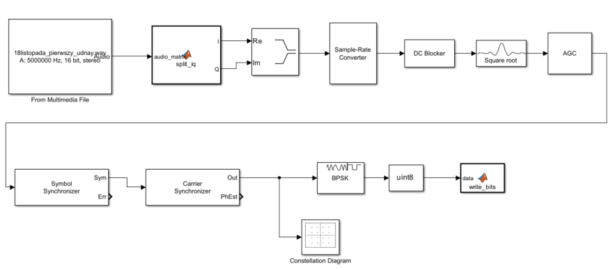
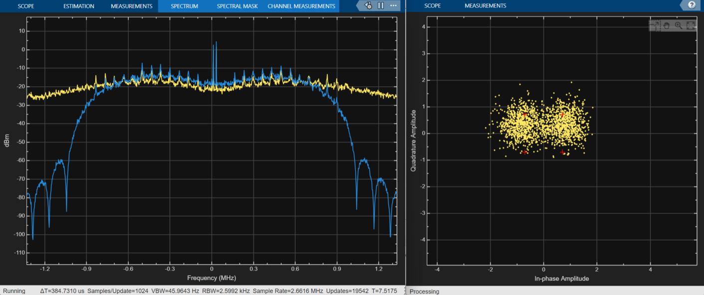

# Meteor HRPT Signal Demodulator in Simulink

This project was created as a practical challenge to learn the Simulink environment and deepen my knowledge of digital signal processing. The goal was to build a complete demodulation chain from scratch for the High Resolution Picture Transmission (HRPT) signal broadcasted by the Meteor series weather satellites.

<figure style="text-align:center;">
  
  <figcaption>
    <em>The complete block diagram of the demodulator circuit in Simulink.</em>
  </figcaption>
</figure>

## Signal Preparation: From `.wav` to the Complex Domain

The input signal for the demodulator comes from a baseband `.wav` recording captured in November 2025. It was recorded using SDR++ and a handheld 60 cm parabolic dish equipped with an offset helical feed made from what I recall to be copper brake line. The physical setup was far from perfect, resulting in a highly noisy signal, the phase center of the helical feed was likely misaligned with the focal point of the dish (the antenna itself had good S11), and the entire system was completely uncalibrated. Given these conditions, it is a miracle that anything was received at all. Nevertheless, as a raw signal source and a proof of concept for the demodulation chain, it serves its purpose perfectly. The recording itself was made with a sample rate of 5 MHz and a 16-bit resolution.

In SDR systems, raw data is sometimes saved as a two-channel audio file (stereo). The left and right channels correspond to the In-phase (I) and Quadrature (Q) components, respectively. To allow Simulink to properly process this data, I wrote a simple MATLAB function to split these streams:

```matlab
function [I, Q] = split_iq(audio_matrix)
    I = audio_matrix(:, 1);
    Q = audio_matrix(:, 2);
end
```

After splitting, the I and Q components are combined into a single stream of complex numbers (*I + jQ*), which provides the mathematical representation of the signal's phase and amplitude over time.

## Resampling

A crucial element of any demodulator is synchronizing the sampling frequency with the physical transmission speed of the satellite.

For the Meteor HRPT signal, the base information data rate is **665.4 kbps**. However, the signal utilizes **Manchester encoding**. Because there is always a state transition in the middle of a transmitted bit, it is possible to synchronize the demodulator with the modulator on every single transmitted bit (without it a long sequence of zeros or ones can cause loss of lock). This provides high resistance to transmission rate variations and simultaneously eliminates the DC component.

The disadvantage of this encoding is that a signal transition also occurs at the beginning of the bit transmission if the previous bit was the same as the current one. As a result, there is a need to use twice the bandwidth compared to an unmodulated signal. Consequently, the actual physical transmission rate over the air is exactly twice as high, resulting in **1.3308 Mbps** (Mega-bits per second).

My input recording was at 5 MHz, which is asynchronous to the satellite's physical data rate. I used the *Sample-Rate Converter* block with `665400 * 4` as the target frequency.

The resulting sample rate of 2.6616 MHz is mathematically significant: it provides exactly 2 samples per transmitted bit.

## Synchronization, Filtering, and BPSK Output

Following the resampling, the signal passes through a Root Raised Cosine (RRC) filter, which limits the bandwidth and reduces Inter-Symbol Interference (ISI), and then through an Automatic Gain Control (AGC) loop. The next section of the schematic consists of a classic synchronization loop:

* Symbol Synchronizer – recovers the timing and selects the optimal sample for a given symbol.

* Carrier Synchronizer – compensates for carrier frequency offset (e.g., Doppler shift) and phase rotation.

The decoded symbols are then fed into the BPSK demodulator block. Technically, this block outputs logical data (0 or 1) in a floating-point format (double). Before writing this data to the disk using the write_bits function, it must be converted to a uint8 (8-bit unsigned integer) type. This ensures that every demodulated bit occupies exactly one byte in the binary file, drastically reducing the file size and allowing for seamless integration with custom C++ decoding scripts.
<figure style="text-align:center;">
  
  <figcaption>
    <em>Spectrum of the Meteor HRPT signal before (yellow) and after (blue) the RRC filter, alongside the BPSK constellation diagram. </em>
  </figcaption>
</figure>

The screenshot above demonstrates the processing chain in action.

The constellation diagram visualizes the received symbols. Since the input file comes from a poorly calibrated, handheld setup, the signal is extremely noisy, the points are heavily scattered, and at first glance, it is barely noticeable that they form the characteristic two dots of BPSK. Despite this poor SNR, the demodulator successfully achieved a phase lock.

## Higher-Layer Decoding Challenges

Building the demodulator was only half the battle. The next step is writing a custom C++ decoder to process the generated bitstream into a frame structure and later into actual pictures.

This proved to be a massive challenge, primarily due to the lack of widely available and clear technical documentation for the Meteor protocols. Unlike Western satellites, where the standards are well documented (such as the <a href="https://user.eumetsat.int/resources/user-guides/metop-direct-readout-ahrpt-guide" target="_blank">EUMETSAT guide for MetOp-B AHRPT</a> ), reverse engineering and referencing open-source code were absolutely necessary here.

Ultimately, my script effectively located the synchronization markers with the hexadecimal value 0x1ACFFC1D within the noisy bitstream.

What is a synchronization marker? It is a unique, predetermined 32-bit sequence (a kind of "signature") that the satellite inserts at the very beginning of every new transport data frame. A radio stream has no distinct start or end, finding this sequence confirms that from this exact moment, the next 1024 bytes contain exactly one data frame.

The fact that the correlator successfully catches these markers in the file generated by my Simulink schematic is proof that the entire demodulation chain works flawlessly.

## Next Steps and Future Projects

Turning those raw frames into actual pictures, however, proved to be an entirely different matter. I failed spectacularly. It turns out that extracting coherent images from a Russian weather satellite is precisely the sort of task the Universe designed to test the structural integrity of a human mind. 

So, for the sake of my own sanity, I am moving on. My next goal is to attempt this exact same feat using MetOp-B data, which I now have direct access to thanks to the ground station we have recently built. Armed with better data, the decoding journey continues.