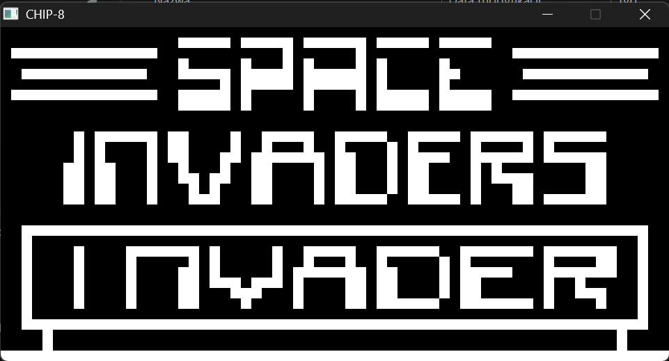
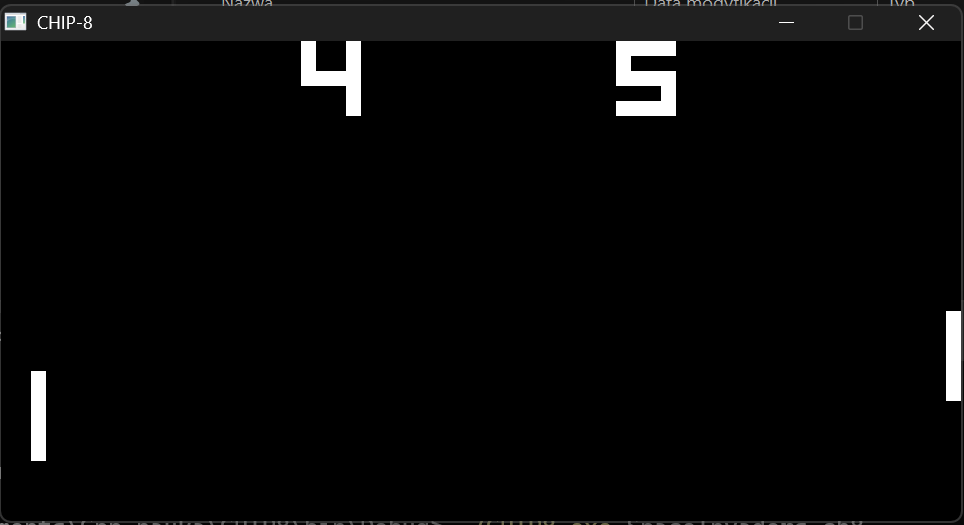

# CHIP-8 Interpreter

### What is CHIP-8?
Developed in the mid-1970s by Joseph Weisbecker, CHIP-8 is not a physical processor or gaming console. Instead, it is an interpreted programming language and virtual machine initially designed to allow video games to be easily programmed and ported across various early microcomputers, such as the COSMAC VIP. 

Its simplicity makes it a perfect introductory project for anyone interested in low-level system architecture and virtual machines. The CHIP-8 specifications are highly constrained, featuring only:
* **4 KB** of memory
* **16** 8-bit data registers
* A **64x32 pixel** monochrome display
* A minimal instruction set of **35 opcodes**

### Interpreter vs. Emulator
While the terms are often used interchangeably in the retro-gaming community, my project is technically a **CHIP-8 Interpreter** rather than an emulator. 

An emulator strives to perfectly replicate the hardware architecture and electrical signals of a specific physical machine, cycle-by-cycle. An interpreter, on the other hand, acts as a software layer that reads instructions (opcodes) and executes their equivalent actions in a host environment. Because CHIP-8 never existed as a physical CPU and was always meant to be run via a software virtual machine, building a program to run CHIP-8 games inherently means writing an interpreter.

### Architectural Approaches to Emulation

When designing a CPU emulator or interpreter, the core architecture typically falls into one of four main categories, ranging from high-level software abstraction to low-level hardware replication:

1. **Switch-Case Based:** The most straightforward software routing method.
2. **Jump-Table Based (Function Pointers):** A highly optimized software approach for routing instructions.
3. **PLA / Microcode Emulation:** A middle-ground strategy that offers an excellent balance between execution speed and architectural complexity.
4. **Graph-Based (Transistor-Level):** The most meticulously accurate method available. It simulates the actual physical connections between transistors on the CPU die, reproducing hardware quirks and undocumented glitches perfectly. However, the computational complexity scales non-linearly with the transistor count. While this is a fascinating approach for retro chips (a brilliant example is the [Visual 6502 project](http://visual6502.org/JSSim/index.html)), trying to emulate a modern multi-core processor this way is practically impossible.

### My Implementation: The Switch-Case Approach

For this CHIP-8 project, I chose to implement the core instruction execution cycle using a **switch-case block**. 

Generally, the switch-case approach is considered the slowest for complex emulators. When dealing with large, sparse integer tables (like the opcode tables of more advanced CPUs), compilers struggle to optimize the code into efficient `O(log n)` structures, resulting in performance bottlenecks. 

However, because this is my very first emulator project, simplicity and readability were my top priorities. The CHIP-8 instruction set consists of only **35 opcodes**. With such a small footprint, a switch-case statement is extremely easy to write, manage, and debug, while any potential performance hit is completely negligible on modern hardware.

### See It In Action

After completing the core opcode implementation and the rendering loop, it was time for the ultimate test: running actual games. Below are screenshots of two timeless classics successfully executed by my interpreter. 

  <figure style="margin: 0; flex: 1; text-align: center;">
    
    <figcaption style="margin-top: 10px; color: #999;">
      <em>Space Invaders — A perfect test for sprite rendering and memory management.</em>
    </figcaption>
  </figure>
  
  <figure style="margin: 0; flex: 1; text-align: center;">
    
    <figcaption style="margin-top: 10px; color: #999;">
      <em>Pong</em>
    </figcaption>
  </figure>

  <em>The ROM files used for testing were sourced from the public <a href="https://github.com/kripod/chip8-roms/tree/master/games" target="_blank">kripod/chip8-roms</a> repository.</em>

See the full code <a href="https://github.com/JanskyContinuum/CHIP8" target="_blank">here</a> (my repository).
### Looking Forward: Jump Tables

If I decide to tackle a more complex system in the future (such as the Nintendo Entertainment System or a GameBoy), a giant switch statement would quickly become unmanageable and slow. The standard engineering upgrade path is to use a **Jump Table** (an array of function pointers).

In a jump-table architecture, instead of asking the program to check the fetched opcode against hundreds of `case` conditions, the opcode itself is used as a direct index in an array. That specific array slot holds a pointer to the exact function needed to execute the instruction. This eliminates the branching logic entirely, reducing the instruction routing to a constant `O(1)` execution time.