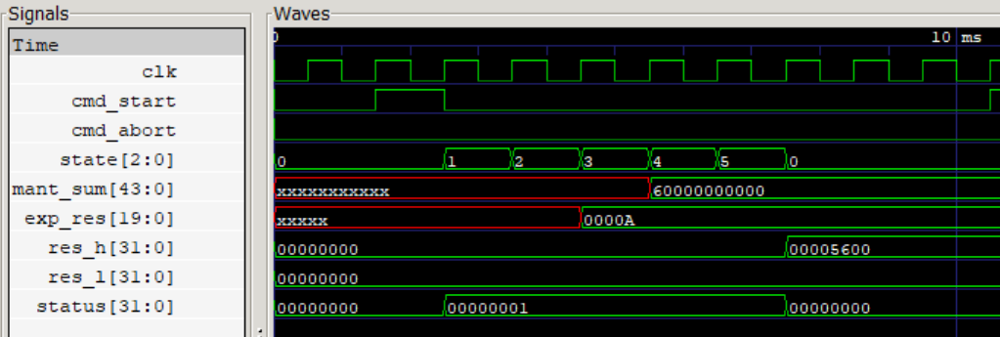
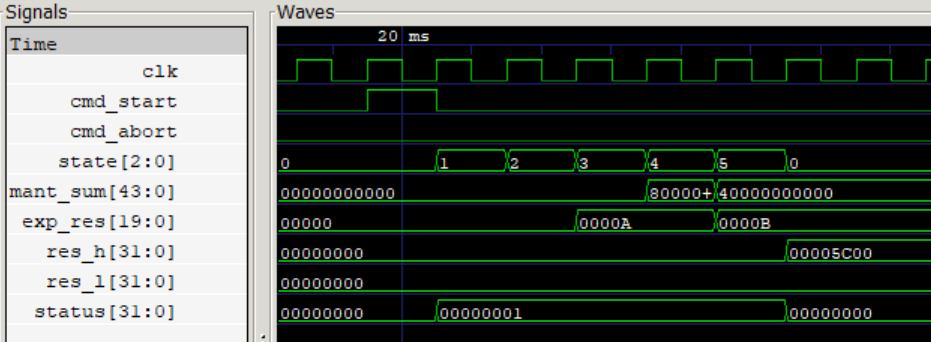
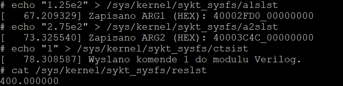
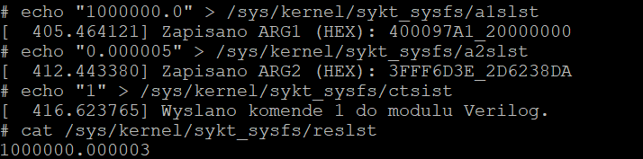

# Custom FPU Coprocessor & Linux Kernel Driver (RISC-V)

This project was developed as part of the "Computer Systems: Architecture and Software" (SYKOM) course. It involved designing a custom hardware accelerator from scratch and bridging it with a custom operating system environment. The core task was to build a hardware module in Verilog for a 32-bit RISC-V SoC (emulated via QEMU) to perform 64-bit floating-point addition, and subsequently write a Linux kernel driver in C to interface with it.

### The Challenge: A Non-Standard Floating-Point Format
Typically, modern systems use the IEEE 754 standard for floating-point arithmetic. However, the assignment specifications required the implementation of a completely custom 64-bit floating-point format. The bit layout was strictly defined as follows:
* **Sign bit:** 1 bit located at the 63rd index.
* **Exponent:** 20 bits starting from the 43rd index.
* **Mantissa:** 43 bits starting from the 0th index.

Furthermore, I was heavily restricted in both domains: the hardware description could not utilize any external libraries or standard loops (like `while` or `for`), and the Linux kernel module had to perform string-to-binary conversions without relying on standard floating-point types or libraries (such as `<math.h>`). 

### Hardware Implementation: Verilog FSM
To adhere to the "no loops" constraint, the entire mathematical operation is driven by a synchronous Finite State Machine (FSM). The hardware addition cycle is broken down into specific states: `STATE_IDLE` (waiting for a command), `STATE_UNPACK` (extracting bits), `STATE_ALIGN` (aligning the exponents), `STATE_ADD` (performing the mantissa addition/subtraction), `STATE_NORM` (normalizing the result), and `STATE_PACK` (assembling the final 64-bit output).

The FSM was designed to handle several critical edge cases natively in the hardware:
* **Hardware Normalization:** If adding two mantissas results in an overflow (e.g., a carry bit pushing the sum out of bounds), the FSM transitions to a state where it shifts the mantissa right (dividing by 2) and increments the exponent to restore the normalized form.
* **The "Dirty Zero" Trap:** When adding numbers of equal magnitude but opposite signs, the mantissas cancel out. The FSM detects this early to prevent an endless normalization loop, immediately clearing the exponent to output a perfect mathematical zero.
* **Asynchronous Abort:** The control register (mapped at relative address `0x98`) allows the system to send an asynchronous ABORT command, instantly halting the FSM and raising a `0x08` error flag in the status register (address `0xB0`).

  <figure style="margin: 0; flex: 1; text-align: center;">
    
    <figcaption style="margin-top: 10px; color: #999; font-size: 0.9em;">
      <em>Standard addition cycle: The FSM progresses through states 0 to 5 upon receiving the start pulse, outputting the assembled result.</em>
    </figcaption>
  </figure>
  
  <figure style="margin: 0; flex: 1; text-align: center;">
    
    <figcaption style="margin-top: 10px; color: #999; font-size: 0.9em;">
      <em>Mantissa overflow: The hardware detects the overflow, shifts the mantissa, and increments the exponent (exp_res changes from A to B).</em>
    </figcaption>
  </figure>

### Software Integration: Linux Kernel Module & SYSFS
To make the hardware accessible to user-space applications, I developed a custom Linux kernel driver. The driver maps the physical I/O memory of the emulator and exposes a virtual interface using the SYSFS filesystem. 

Users interact with the coprocessor by writing strings in scientific decimal notation (e.g., `"1.25e2"`) directly to specific virtual files (`a1slst` for argument 1, `a2slst` for argument 2, and `ctsist` for the command trigger). 

Because the kernel space prohibits standard floating-point operations, I wrote custom parsers utilizing only bitwise operations and 32-bit fixed-point arithmetic. These parsers translate the incoming decimal strings into the strict 64-bit custom binary layout required by the hardware registers (`0xC8`/`0xD0` for arg1, `0xB8`/`0xC0` for arg2), and then parse the hardware result (`0xA0`/`0xA8`) back into a readable string in the `reslst` file.

### System Testing & Precision Limitations
Testing the full hardware-software stack via the Linux shell proved the system could successfully handle fractional precision and negative numbers. 

However, floating-point representations are inherently imperfect. During extreme edge-case testing, I added a very large number ($1000000.0$) and a very small number ($0.000005$). The system returned $1000000.000003$, yielding an absolute error of $0.000002$. This perfectly demonstrates the limitations of the 43-bit mantissa format: when the hardware FSM aligns exponents that differ drastically, it must shift the smaller mantissa so far to the right that the least significant bits fall off the register and are permanently truncated.

  <figure style="margin: 0; flex: 1; text-align: center;">
    
    <figcaption style="margin-top: 10px; color: #999; font-size: 0.9em;">
      <em>Sending scientific notation to the SYSFS endpoints. The kernel parses "1.25e2" and "2.75e2", correctly fetching the result: 400.000000.</em>
    </figcaption>
  </figure>
  
  <figure style="margin: 0; flex: 1; text-align: center;">
    
    <figcaption style="margin-top: 10px; color: #999; font-size: 0.9em;">
      <em>Observing the physical limitations of the 43-bit mantissa. The addition of vastly different magnitudes results in a truncation error.</em>
    </figcaption>
  </figure>

See the full code <a href="https://github.com/JanskyContinuum/FPU" target="_blank">here</a> (my repository).
