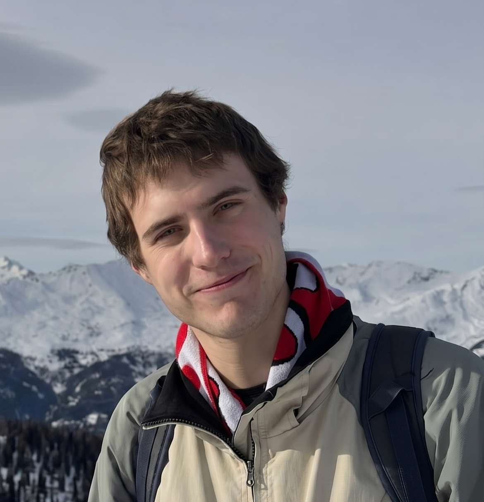

# Stanisław Słowiński

Hi, I'm a Telecommunications Engineering student at the Warsaw University of Technology and the founder of the Student Club of Antenna Design. 🛰️

My work bridges the gap between hardware engineering and software development. I specialize in applied electromagnetics and programming, with a strong focus on Space Systems and Ground Segment infrastructure. 

Currently, I am developing an automated Ground Station for LEO meteorological satellites (MetOp-B), integrating SDR receivers, and custom Python/Linux control architectures.

**Technical Focus & Interests:**
* **Space & Ground Segments:** Satellite tracking, link budget analysis, and automated mission operations.
* **RF Engineering:** Antenna design (Altair FEKO), microwave circuits, and Software-Defined Radio (SDR).
* **Software Engineering:** hardware-software integration, emulators, microcontrollers, automation.
* **Radio Astronomy:** Passionate about deep-space observation and pushing the limits of amateur and academic RF instrumentation.

I thrive in projects that require building robust physical prototypes and writing the software to make them come alive.

Find me on <a href="https://www.linkedin.com/in/stanis%C5%82aw-s%C5%82owi%C5%84ski-409553267/" target="_blank">LinkedIn</a> or <a href="https://github.com/JanskyContinuum/" target="_blank">GitHub</a>. Not every project I've worked on has made it to this page (or GitHub) just yet! I'm currently organizing my local archives and will be publishing more repositories soon.